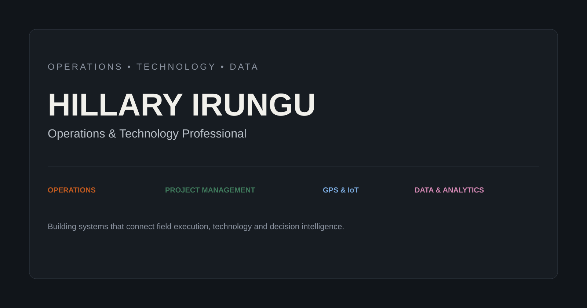

# Hillary Irungu — Operations • Technology • Data

  <a href="https://hillaryirungu.github.io"><strong>View the live portfolio →</strong></a>

## Overview

This repository contains the source code for **Hillary Irungu's professional portfolio** — a practical view of work across operations, technology, GPS & IoT, data analytics, project management and process optimization.

The portfolio shows how **field operations, technology and data come together to improve execution, visibility and decision-making**.

## What this repository contains

- **Professional portfolio website** — responsive single-page portfolio built for GitHub Pages.
- **Operations & technology experience** — operational leadership, process transformation, GPS/IoT and asset intelligence.
- **Data & analytics projects** — quantitative finance, machine learning, deep learning and risk analytics.
- **Applied technology work** — automation, workflow engineering and operational systems.
- **Live project links** — including the Portfolio Risk Dashboard and selected GitHub projects.

## Key features

- Responsive design across desktop, tablet and mobile
- Light/dark theme support
- Operations, technology and data-focused professional positioning
- Interactive project cards and code snippets
- Live Portfolio Risk Dashboard preview
- Direct links to project repositories and professional profiles
- GitHub Pages deployment from the main branch

## Technology

| Area | Technologies |
| --- | --- |
| Front end | HTML5, CSS3, JavaScript |
| Data | Python, analytics, quantitative finance |
| Machine learning | Machine learning, deep learning, LSTM, CNN-GAF |
| Automation | Google Apps Script, workflow automation |
| Deployment | GitHub Pages |
| Applications | Streamlit |

## Project structure

    Hillaryirungu.github.io/
    ├── index.html
    ├── style.css
    ├── assets/
    │   └── portfolio-banner.svg
    └── README.md

## Featured work

### Portfolio Risk Dashboard

An end-to-end financial risk analytics application combining market-data ETL, an offline-safe fallback, quantitative risk metrics and interactive portfolio stress testing.

**Metrics include:** Sharpe, Sortino and Calmar ratios, maximum drawdown, VaR, CVaR, beta, correlation and stress testing.

- [Open the live application](https://hillaryirungu-portfolio-risk-dashboard.streamlit.app/)
- [View the GitHub repository](https://github.com/Hillaryirungu/Portfolio-Risk-Dashboard)

### Other selected projects

- [Mitigating Information Leakage in Validation Protocols](https://github.com/Hillaryirungu/Mitigating-Information-Leakage-in-Validation-Protocols)
- [Financial Return Prediction Project](https://github.com/Hillaryirungu/Financial-Return-Prediction-Project)
- [Deep Learning for Financial Return Prediction](https://github.com/Hillaryirungu/notebooks-Deep_learning_finance_return_prediction.ipynb)
- [KPRIS Security System](https://github.com/Hillaryirungu/KPRIS-Security-System)

## Portfolio

**Live site:** [hillaryirungu.github.io](https://hillaryirungu.github.io)

The portfolio covers:

**Operations** · Operations management · Process optimization · Service delivery · Team management

**Technology** · GPS & IoT · Asset tracking · Systems implementation · Automation

**Data** · Python · Data analytics · Machine learning · Financial modelling

**Management** · Project management · Risk management · Process design · Cross-functional leadership

## Deployment

The site is deployed through **GitHub Pages** from the main branch.

Changes committed to the repository can be published through the repository's GitHub Pages configuration.

## About

**Hillary Irungu** is an Operations & Technology Professional working at the intersection of operations, technology, data and intelligence.

His work focuses on understanding how an operation actually runs, identifying where it breaks, structuring the data behind it, and building systems that make execution faster, more visible and easier to measure.

- [GitHub](https://github.com/Hillaryirungu)
- [LinkedIn](https://www.linkedin.com/in/hillary-irungu/)

---

**Repository:** Hillaryirungu/Hillaryirungu.github.io  
**Primary stack:** HTML · CSS · JavaScript · Python · GitHub Pages
